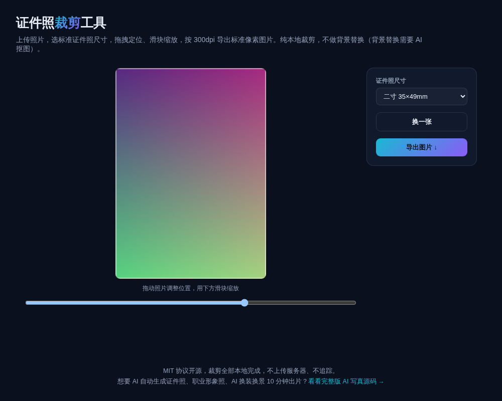

# 证件照裁剪工具 · ID Photo Crop

**[在线体验 →](https://anna123123123-creator.github.io/id-photo-crop/)**

免费开源、纯浏览器运行的证件照标准尺寸裁剪工具。上传照片，选一寸 / 二寸 / 小二寸 / 护照 / 美签等标准尺寸，拖拽定位、滑块缩放，按 300dpi 导出可直接打印的标准像素图片。全部本地处理，不上传服务器。



## 试用方法

直接用浏览器打开 `index.html`，或用静态文件服务器跑起来：

```bash
python3 -m http.server 8000
```

上传照片后，在预览框里拖动照片调整位置，用下方滑块缩放大小，选好尺寸后点导出。

## 支持的尺寸

| 规格 | 毫米 | 300dpi 像素 |
|---|---|---|
| 一寸 | 25×35mm | 295×413px |
| 二寸 | 35×49mm | 413×579px |
| 小二寸 | 35×45mm | 413×531px |
| 护照 | 33×48mm | 390×567px |
| 美签 | 51×51mm | 602×602px |

## 说明

这个工具**只做裁剪定位**，不做背景替换/抠图——真正的背景替换需要图像分割模型，纯前端算法做不到干净的效果，所以诚实地不做。

## 协议

MIT。

## 需要定制版？

这个工具免费开源、可以直接用。如果你需要的是**改造成适合自己业务的版本**——换品牌、改字段、加功能、接后端或数据库——我可以做。

- **交付周期**：3–10 个工作日
- **交付内容**：完整源码（不加密、可自行二次开发）+ 在线地址 + 部署说明
- **已有 49 套现成系统**可直接改造，覆盖电商、教育、门店、内容、跨境等行业：[全部清单与在线演示](https://inzyxuashop.com)

把你的需求发给我，24 小时内回复可行性与报价：**evcdecd@gmail.com**
